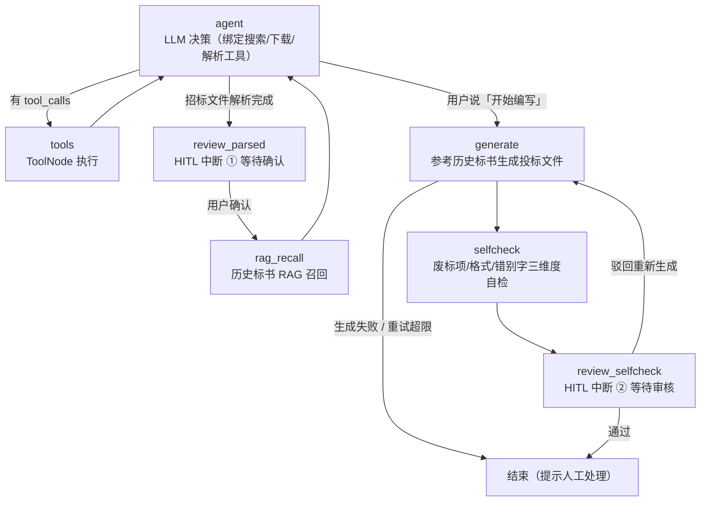
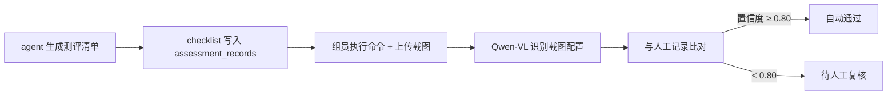

# 等保测评全流程助手（mlps-assistant）

面向**等级保护（MLPS）测评业务**的垂直领域 AI Agent 全栈项目。用户用自然语言驱动两条业务线：

- **商务线（招投标）**：联网搜索招标公告 → 下载并解析招标文件（预算/评分表/资格要求/废标项）→ **人工确认** → RAG 检索历史标书 → 生成投标文件 → 废标自检 → **人工审核**（通过 / 驳回重新生成，重试超限转人工）
- **技术线（测评核查）**：按等保级别生成控制点清单 → 组员执行测评命令并上传截图 → Qwen-VL 识别截图配置 → 与人工记录比对 → 置信度 ≥ 0.80 自动通过，否则转人工复核

另有知识库入库（等保标准/企业本地文档/历史标书，按 `kb_type` 分集合）、投标文件审核、网络拓扑图生成（前端 vue-flow 可视化）。

## 架构

后端 FastAPI 四层架构（路由 / 校验 / 业务 / 数据库），AI 侧为「模型层 - 提示词层 - 记忆层」三层 + LangGraph 状态机编排。

### 商务线 Agent 图（LangGraph，两处 HITL 人工中断）



两个中断点用 langgraph 的 `interrupt()` 函数实现（0.2.x 的 `interrupt_before` + `Command(resume=dict)` 不会更新 state 字段，实测），通过 `/chat/{thread_id}/resume` 恢复执行。

### 技术线测评链路



## 技术栈

| 层 | 技术 |
|---|---|
| 后端 | FastAPI · SQLAlchemy 2.0 · MySQL + Alembic · Pydantic v2 · PyJWT（双 token）· MinIO · APScheduler（过期清理） |
| AI | LangChain 0.3 · LangGraph 0.2（状态机 + HITL 中断）· DeepSeek（工具调用/生成/自检）· Qwen-VL（截图识别）· DashScope Embedding · Qdrant（RAG）· Tavily（联网搜索）· 火山引擎 OCR（扫描件兜底） |
| 前端 | Vue 3 + TypeScript · Vite · Element Plus · vue-flow（拓扑图）· SSE 流式渲染 |
| 测试 | pytest + httpx（覆盖 AI 三层 / 流式聊天 / 认证 / 知识库入库等） |

## 目录结构

```
backend/
  app/
    ai/            # LangGraph 状态机（graph.py）、工具集（tools.py）、模型/提示词/记忆三层、RAG 入库、OCR
    routers/       # auth / user / upload / sessions / kb / bidding_tasks / assessment* / chat_stream / health
    schemas/       # Pydantic 校验模型
    services/      # MinIO 上传、测评业务、清理调度
    db/            # SQLAlchemy 模型与会话
  alembic/         # 数据库迁移
  tests/           # pytest 测试（含 fixtures）
  Bprompt.md / agentprompt.md / jishuprompt.md   # 逐阶段开发需求记录（prompt 驱动迭代）
frontend/
  src/views/       # Login / Chat（对话） / AssessmentWorkbench（测评工作台） / Review（审核） / Knowledge（知识库） / Topology（拓扑）
  src/components/  # 按 assessment / bidding / chat / knowledge / review / topology 分组
```

## 快速开始

依赖服务：MySQL 8、MinIO（示例端口 19000）、Qdrant（示例端口 16333）、DeepSeek / DashScope / Tavily API Key。

**后端**（Python 3.11+）：

```bash
cd backend
python -m venv .venv && .venv\Scripts\activate     # Windows
pip install -r requirements.txt
copy .env.example .env                              # 填写 MySQL/JWT/各 API Key
alembic upgrade head
uvicorn app.main:app --reload --port 8000
```

启动后访问 `http://127.0.0.1:8000/docs` 查看接口文档。

**前端**（Node 18+）：

```bash
cd frontend
npm install
npm run dev      # http://localhost:5173，/api 代理到后端 8000
```

**测试**：

```bash
cd backend && pytest
```

## 配置

所有敏感配置只从环境变量 / `.env` 读取（模板见 [backend/.env.example](backend/.env.example)），代码不写死密钥。CORS 来源通过 `CORS_ORIGINS` 配置（逗号分隔），默认放行本地 Vite 开发服务器，生产环境必须改为前端实际域名。

## 已知限制 / 后续计划

- LangGraph checkpointer 目前为进程内 `MemorySaver`，服务重启后中断会话不可恢复，计划换 `SqliteSaver` 持久化
- 「开始编写」触发词依赖用户消息字符串匹配，计划改为意图识别
- `routers/chat_stream.py` 承担了 SSE 编排与 HITL 恢复的较多逻辑，计划拆分到 service 层
